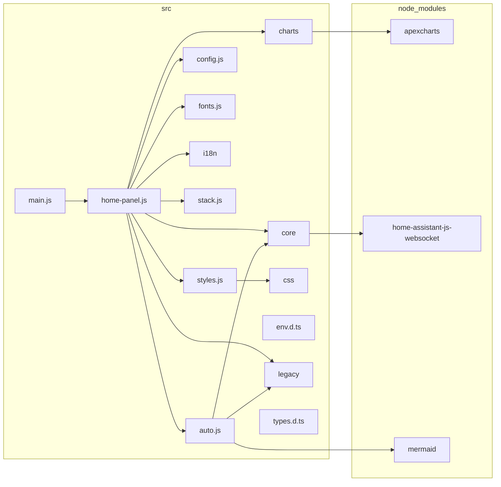

# Dependency graph

Generated by `npm run arch:graph` from the imports under `src/`, folded to its folders. Do not edit by hand: a test fails when it is out of date.

```mermaid
flowchart LR

subgraph 0["node_modules"]
1["apexcharts"]
2["home-assistant-js-websocket"]
3["mermaid"]
end
subgraph 4["src"]
5["auto.js"]
6["charts"]
7["config.js"]
8["core"]
9["css"]
A["env.d.ts"]
B["fonts.js"]
C["home-panel.js"]
D["i18n"]
E["legacy"]
F["main.js"]
G["stack.js"]
H["styles.js"]
I["types.d.ts"]
end
5-->8
5-->E
5-->3
6-->1
8-->2
C-->5
C-->6
C-->7
C-->8
C-->B
C-->D
C-->E
C-->G
C-->H
F-->C
H-->9
```
